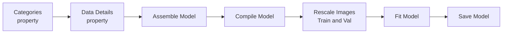
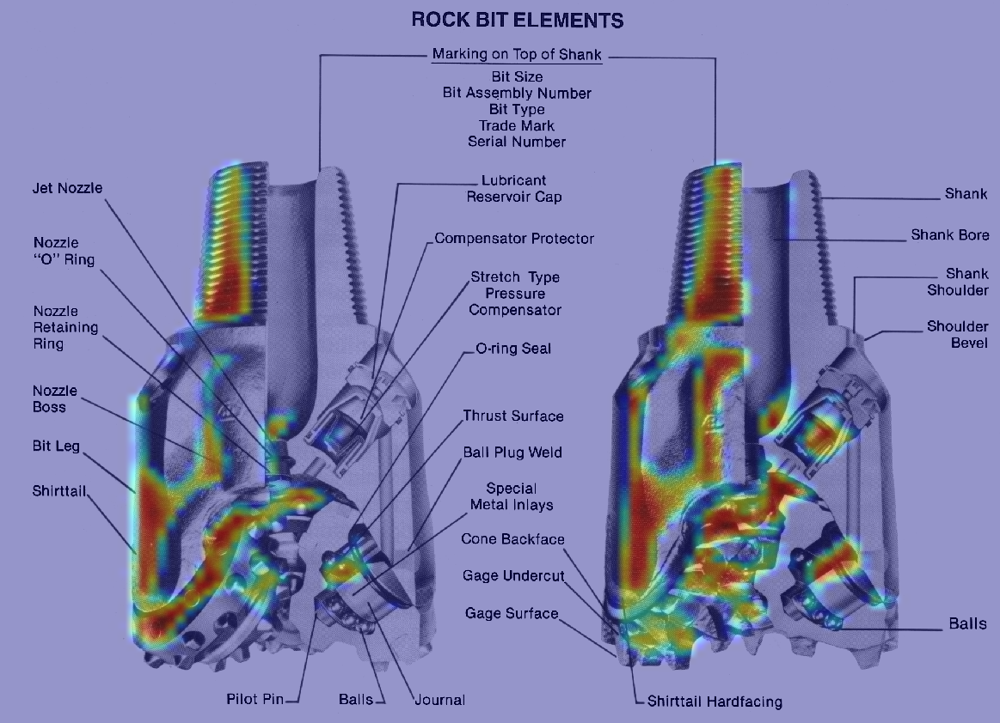
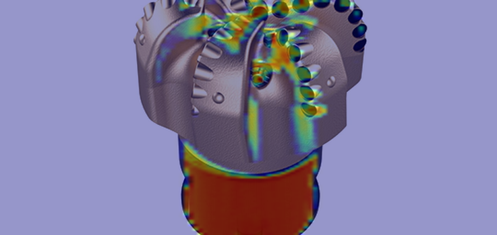

# Drill Bit Classifier

The Drill Bit Classifier is an app that uses a Convolutional Neural Network (CNN) to 
classify images of drill bits. The app can be used by machinists and engineers to 
quickly and accurately identify the type of drill bit required for a particular job.

## Description:
### Preprocessing Module
The code is for image preprocessing for a neural network. 
It contains functions to download images from Bing, read data from a directory, 
and augment the images. The code also includes a class called Preprocessing. 
The class has methods to download images, find categories, get image data, and 
augment the images.

The Preprocessing class has an initializer that takes an argument dataset_address 
and assigns it to an instance variable dataset_address. The download_images method 
downloads images from the internet using the bing_image_downloader library. 
The categories_name method reads the dataset directory and returns a list of categories. 
It also removes any files that are in the ignore list specified in the SETTING module. 
The image_dict method returns a dictionary with the number of images and a list of image 
file paths for each category. The augment_data method augments the images in each 
category using the ImageDataGenerator class from keras.preprocessing.image module. 
The augmented images are saved to the dataset_augmented directory.

### Bit Vision Module
The BitVision class is designed to train a neural network model for bit vision. It provides various methods for assembling and training the model, as well as performing predictions and visualizations.
The class has an initialization method that sets the train_test_val_dir attribute, which represents the directory where the training, testing, and validation data is stored. It also initializes other attributes such as model, train_vali_gens, and model_class_indices.
The categories property returns a list of categories based on the subdirectories in the train_test_val_dir. It filters out any unwanted categories specified in the IGNORE_LIST.
The data_details property returns a dictionary containing the details of the training, testing, and validation data. It counts the number of files in each category and stores the information in the dictionary.
The assemble_deep_net_model method creates a sequential model for the neural network. It adds convolutional, batch normalization, max pooling, dropout, and dense layers to the model based on predefined settings.
The compile_model method compiles the model by specifying the optimizer, loss function, and metrics to be used during training.
The plot_image_category method plots images from the training data for each category. It accepts parameters such as the number of rows and columns in the plot, the subdirectory (e.g., "train"), and the figure size.
The _rescaling method is responsible for rescaling the images before training. It uses the ImageDataGenerator class from Keras to rescale the images based on the specified settings.
The check_points method returns a ModelCheckpoint object, which is used to save the best model during training based on a specified monitor metric.
The train_model method trains the model using the training and validation data. It uses the fit_generator function to perform the training, specifying various parameters such as the number of epochs, validation data, class weights, and callbacks (including the checkpoint).
The plot_history method plots the training and validation loss and accuracy over epochs. It generates separate plots for each metric and saves the figure as "history.png".
The filter_out_list method filters out unwanted elements from a given list based on a predefined ignore list.
The predict method performs predictions on test images using the trained model. It loads the model, iterates over each category, selects test images, and predicts their labels. It plots the images with their predicted labels and saves the figures in a specified directory.
The grad_cam_viz method visualizes the class activation heatmap using Grad-CAM. It loads the model, prepares the input image, generates the heatmap using the last convolutional layer, and displays the heatmap along with the original image. The resulting heatmap is saved as an image file.
Overall, the BitVision class provides functionality for training, evaluating, and visualizing a neural network model for bit vision tasks. It encapsulates the necessary preprocessing steps, model assembly, training process, and prediction visualization, making it convenient to use for bit vision applications.

### Process Module

### Bit Vision Module

[//]: # (# CNN Model Prediction on Test Data)

[//]: # (![alt text]&#40;figures/prediction_pdc_bit.png "Logo Title Text 1"&#41;)

[//]: # (![alt text]&#40;figures/prediction_rollercone_bit.png "Logo Title Text 1"&#41;)

## Grad Cam Heatmap - Rollercone Bit

## Grad Cam Heatmap - PDC Bit
