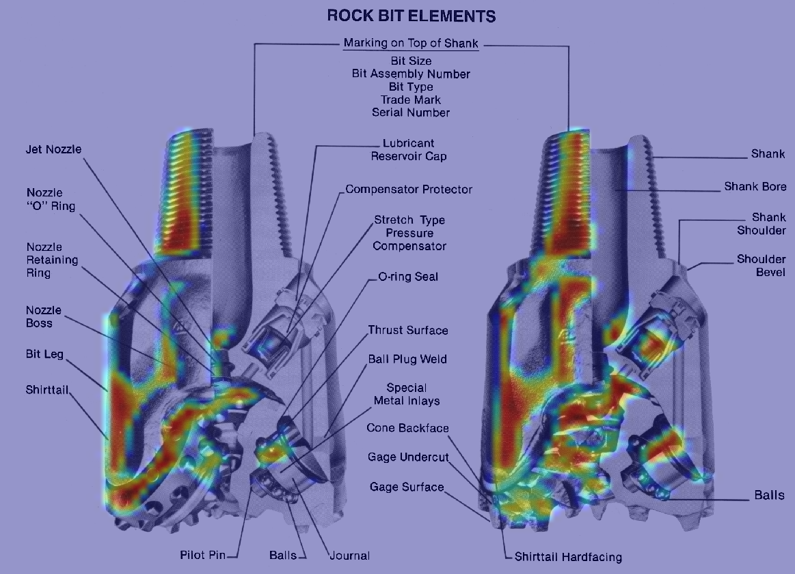
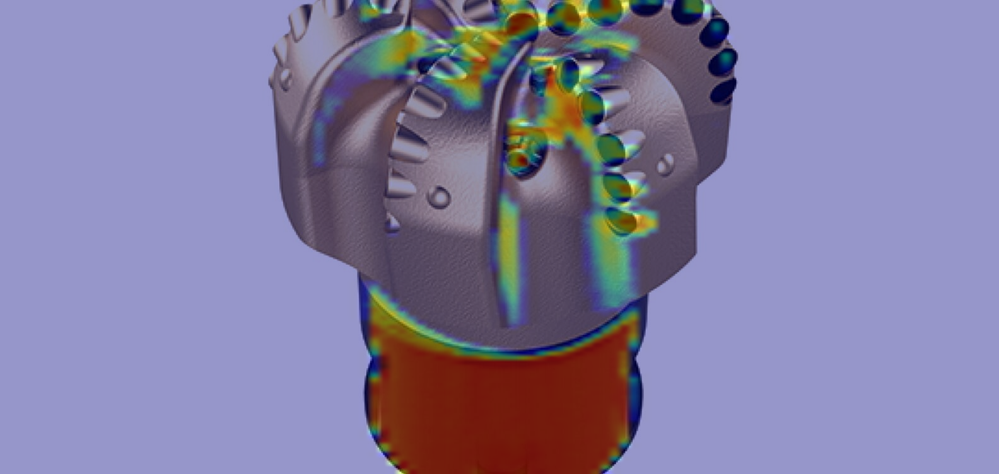
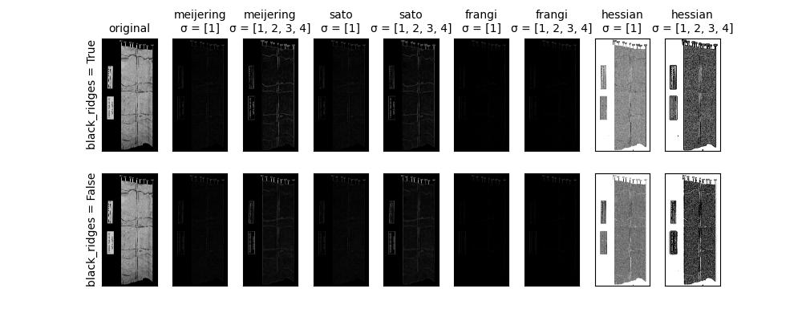

# Drill Bit Classifier

[](https://www.python.org/downloads/release/python-360/)

[](https://pepy.tech/project/drillvision)

The Drill Bit Classifier is an app that uses a Convolutional Neural Network (CNN) to 
classify images of drill bits. The app can be used by machinists and engineers to 
quickly and accurately identify the type of drill bit required for a particular job.

## Description:
### Preprocessing Module
The code is for image preprocessing for a neural network. 
It contains functions to download images from Bing, read data from a directory, 
and augment the images. The code also includes a class called Preprocessing. 
The class has methods to download images, find categories, get image data, and 
augment the images.

The Preprocessing class has an initializer that takes an argument dataset_address 
and assigns it to an instance variable dataset_address. The download_images method 
downloads images from the internet using the bing_image_downloader library. 
The categories_name method reads the dataset directory and returns a list of categories. 
It also removes any files that are in the ignore list specified in the SETTING module. 
The image_dict method returns a dictionary with the number of images and a list of image 
file paths for each category. The augment_data method augments the images in each 
category using the ImageDataGenerator class from keras.preprocessing.image module. 
The augmented images are saved to the dataset_augmented directory.

### Bit Vision Module


BitVision is a versatile library initially designed for training, evaluating, and visualizing neural network models specifically tailored to subject with focus on drilling engineering classification tasks. However, it has since evolved to support general classification problems beyond drilling bits. With BitVision, you can effortlessly assemble and train models, make predictions, and generate visualizations for various classification applications, including but not limited to drilling bits.
- **Model Assembly**: BitVision provides methods to assemble deep neural network models for bit vision tasks. You can add convolutional layers, batch normalization, max pooling, dropout, and dense layers based on predefined settings.

- **Data Preparation**: The library handles data preprocessing tasks such as rescaling images using the ImageDataGenerator class from Keras. It also allows you to obtain details about the training, testing, and validation data, including the number of files in each category.

- **Training and Evaluation**: BitVision simplifies the model training process with the fit_generator function. You can specify the number of epochs, validation data, class weights, and utilize ModelCheckpoint to save the best model based on a chosen metric. Additionally, the library provides methods to plot training and validation loss and accuracy over epochs.

- **Prediction Visualization**: With BitVision, you can easily perform predictions on test images using the trained model. The library facilitates plotting images with their predicted labels and saving the figures for analysis and presentation.

- **Grad-CAM Visualization**: BitVision offers functionality to visualize class activation heatmaps using Grad-CAM. You can overlay the heatmaps on the original images and save the resulting visualizations.

### Transfer Learning Module

The code imports necessary libraries and modules, including TensorFlow, NumPy, pandas, seaborn, and matplotlib.
The code defines a class called TransferModel that inherits from two other classes: Preprocessing and BitVision. These classes seem to provide additional functionality for data preprocessing and working with images.
The TransferModel class has several methods for preparing the data, plotting class distributions, analyzing image names, plotting images, performing train-test split, creating data generators, and creating the model.
The TransferModel class uses the MobileNetV2 architecture for transfer learning. It includes methods for creating data generators using ImageDataGenerator from TensorFlow and training the model.


[//]: # (### Process Module)

[//]: # (```mermaid)

[//]: # (flowchart LR)

[//]: # ()
[//]: # (A[Download Data\n Bing module] --> B[1-find category names\n 2-make an image dictionary])

[//]: # (B --> C[Augment data] --> D)

[//]: # (D[Train Test  Val Split] --> E[Populate images into the\ntrain test val folders] --> F[Train the model])

[//]: # (```)


[//]: # (### Bit Vision Module)

[//]: # (```mermaid)

[//]: # (flowchart LR)

[//]: # (A[Categories\nproperty] --> B[Data Details\nproperty])

[//]: # (B --> C[Assemble Model] --> D[Compile Model] --> E[Rescale Images\nTrain and Val] )

[//]: # (--> F[Fit Model] --> G[Save Model])

[//]: # (```)

## Grad Cam Heatmap - Rollercone Bit


## Grad Cam Heatmap - PDC Bit



# How to use the Drill Bit Classifier Example
## Installation
```bash
pip install drillvision
```
## Usage

```python
from pathlib import Path
from neural_network_model.process_data import Preprocessing
from neural_network_model.bit_vision import BitVision

if __name__ == "__main__":
    # download the images
    obj = Preprocessing(dataset_address=Path(__file__).parent / "dataset")
    obj.download_images(limit=10)
    print(obj.image_dict)
    obj.augment_data(
        number_of_images_tobe_gen=10,
        augment_data_address=Path(__file__).parent / "augmented_dataset"
    )
    obj._train_test_split(
        augmented_data_address=Path(__file__).parent / "augmented_dataset",
        train_test_val_split_dir_address=Path(__file__).parent / "dataset_train_test_val"
    )

    obj = BitVision(train_test_val_dir=Path(__file__).parent / "dataset_train_test_val")
    print(obj.categories)
    print(obj.data_details)
    obj.plot_image_category()
    obj.compile_model()
    #
    model_name = "model_epoch_{epoch:02d}_loss_{loss:.2f}_acc_{accuracy:.2f}_val_acc_{val_accuracy:.2f}_.h5"
    obj.train_model(
        epochs=8,
        model_save_address=Path(__file__).parent / "deep_model",
        model_name=model_name
    )
    obj.plot_history(fig_folder_address=Path(__file__).parent / "figures")

    best_model = obj.return_best_model_name(directory="deep_model")

    obj.predict(
        fig_save_address=Path(__file__).parent / "figures",
        model_path=Path(__file__).parent / "deep_model" / best_model,
        test_folder_address=Path(__file__).parent / "dataset_train_test_val" / "test"
    )

    # find list of images in the Path(__file__).parent / "dataset_train_test_val" / "test" / "pdc_bit"
    directory_path = Path(__file__).parent / "dataset_train_test_val" / "test" / "pdc_bit"
    list_of_images = [str(x) for x in directory_path.glob("*.jpeg")]

    obj.grad_cam_viz(
        model_path=Path(__file__).parent / "deep_model" / best_model,
        fig_to_save_address=Path(__file__).parent / "figures",
        img_to_be_applied_path=Path(__file__).parent / "dataset_train_test_val" / "test" / "pdc_bit" / list_of_images[
            0],
        output_gradcam_fig_name="gradcam.png"
    )
```

## Using TransferLearning Module

```python
from neural_network_model.transfer_learning import TransferModel
from pathlib import Path

transfer_model = TransferModel(
    dataset_address=Path(__file__).parent / "dataset"
)

transfer_model.plot_classes_number()
transfer_model.analyze_image_names()
transfer_model.plot_data_images(num_rows=3, num_cols=3)
transfer_model.train_model(epochs=3,
                           model_save_path=(Path(__file__).parent / ".." / "deep_model").resolve(),
                           model_name="tf_model_2.h5")
transfer_model.plot_metrics_results()
transfer_model.results()
# one can pass the model address to the predict_test method
transfer_model.predict_test()
transfer_model.grad_cam_viz(num_rows=3, num_cols=2)
```

Note that the dataset structure should be as follows:
```
├── dataset
│   ├── class 1
│   └── class 2
│   └── class 3
│   └── class .
│   └── class .
│   └── class .
│   └── class N      
```

## Visual Insight module

This module empowers users to enhance their images using diverse filters such as Hessian, Frangi, LBP (Local Binary Pattern), multi-Otsu thresholding, and Sobel. Additionally, the module facilitates the extraction of histogram features from the filtered outcomes. It computes histograms for each color channel (R, G, B) of the filtered image, yielding histogram counts that serve as features.
Moreover, users have the capability to engage in image segmentation through the utilization of the K-means clustering algorithm. This method applies image segmentation to a batch of images within a designated directory, employing a specified clustering technique (with K-Means being the default). 

## Applying Ridge operators

```python
dataset_path = Path(__file__).parent / ".." / "dataset"
obj = ImageNumeric(dataset_address=dataset_path)
image_path = str(
    (
            Path(__file__).parent
            / ".."
            / "dataset"
            / "pdc_bit"
            / "Image_26.jpg"
    )
)

obj.scikit_image_example(
    image_path,
    section_zoom=[0, 2000, 0, 1000],
    save_path=Path(__file__).parent / ".." / "assets",
    save_name="scikit_image_example.jpg",
)
    
```




* Extracting histogram features
```python
obj = ImageNumeric()
print(obj.image_df.head())
# Load the image
image_path = str(
    (
        Path(__file__).parent
        / ".."
        / "dataset_ad"
        / "MildDemented"
        / "mildDem0.jpg"
    )
)

# Apply hessian filter
hessian_features = obj.hessian_filter_feature_extraction(
    image_path, plt_show=True, plt_log=True, cmap="seismic"
)
print(hessian_features)

# Apply frangi filter
frangifeatures = obj.frangi_feature_extraction(
    image_path,
    plt_show=True,
    plt_log=True,
)
print(frangifeatures)

# # Apply LBP filter
lbp_result = obj.lbp_feature_extraction(image_path, plt_show=True, plt_log=True)
print(lbp_result)

# Apply Multi-Otsu thresholding
multi_otsu_features = obj.multiotsu_threshold_feature_extraction(
    image_path, plt_show=True, plt_log=True
)
print(multi_otsu_features)

# # Apply Sobel edge detector
sobel_features = obj.sobel_edge_detection_sk(
    image_path, plt_show=True, plt_log=True, cmap="gray"
)
print(sobel_features)


```

* Filtering images
```python
dataset_path = Path(__file__).parent / ".." / "dataset_ad"
obj = ImageNumeric(dataset_address=dataset_path)

# followings are code apply to whole directory
# hessian by default
obj.filter_images(
    dataset_path=dataset_path,
    filtered_dataset_path=Path(__file__).parent
    / ".."
    / "filtered_dataset_ad_hessian",
    replace_existing=False,
    cmap="seismic",
    filter_name="hessian",
)
# obj.filter_images(
#     dataset_path=dataset_path,
#     filtered_dataset_path=Path(__file__).parent / ".." / "filtered_dataset_ad_frangi",
#     replace_existing=False,
#     cmap="seismic",
#     filter_name="frangi"
# )
# obj.filter_images(
#     dataset_path=dataset_path,
#     filtered_dataset_path=Path(__file__).parent / ".." / "filtered_dataset_ad_lbp",
#     replace_existing=False,
#     cmap="gray",
#     filter_name="lbp"
# )

```

* Image segmentation
```python

dataset_path = Path(__file__).parent / ".." / "dataset_ad"
obj = ImageNumeric(dataset_address=dataset_path)
image_path = str(
    (
        Path(__file__).parent
        / ".."
        / "dataset_ad"
        / "MildDemented"
        / "mildDem1.jpg"
    )
)

# only on one image
obj.image_segmentation_knn(
    image_path, num_clusters=3, plt_show=True, cmap="viridis"
)
# whole directory
obj.image_segmentation(
    clustering_method="kmean",
    dataset_path=dataset_path,
    segmentation_dataset_path=Path(__file__).parent / ".." / "segmentation_dataset_ad_kmean_3",
    num_clusters=3,
    cmap="viridis",
)
```

* Displaying images from data directory
```python
obj = ImageNumeric(dataset_address=Path(__file__).parent / ".." / "dataset_ad")

# Display the images
# Example title mapping (custom titles for labels)
custom_titles = {
    "NonDemented": "Healthy",
    "ModerateDemented": "Moderate",
    "MildDemented": "Mild",
    "VeryMildDemented": "Very Mild",
}
obj.display_img_class(
    selected_imgs=[
        "nonDem441.jpg",
        "verymildDem1622.jpg",
        "mildDem262.jpg",
        "moderateDem38.jpg",
    ],
    _random=False,
    title_mapping=custom_titles,
    arrangement="1x4",
    figsize=(10, 5),
    title_show=True,
    # axes_ticks=False,
)
```

* Color map image
```python
dataset_path = Path(__file__).parent / ".." / "dataset_ad"
obj = ImageNumeric(dataset_address=dataset_path)

obj.apply_colormap_to_directory(
    cmap="seismic",
    dataset_path=dataset_path,
    edited_dataset_path=Path(__file__).parent / ".." / "edited_dataset_ad",
    replace_existing=False,
)
```


